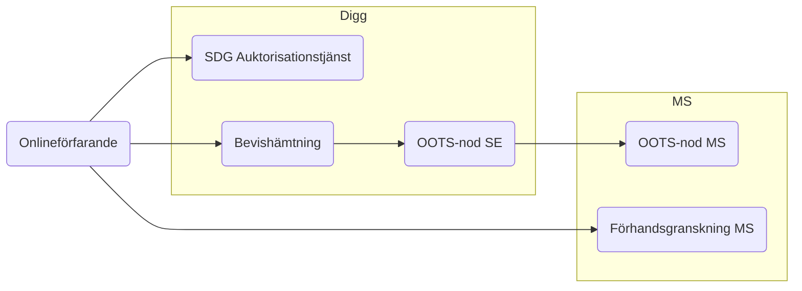
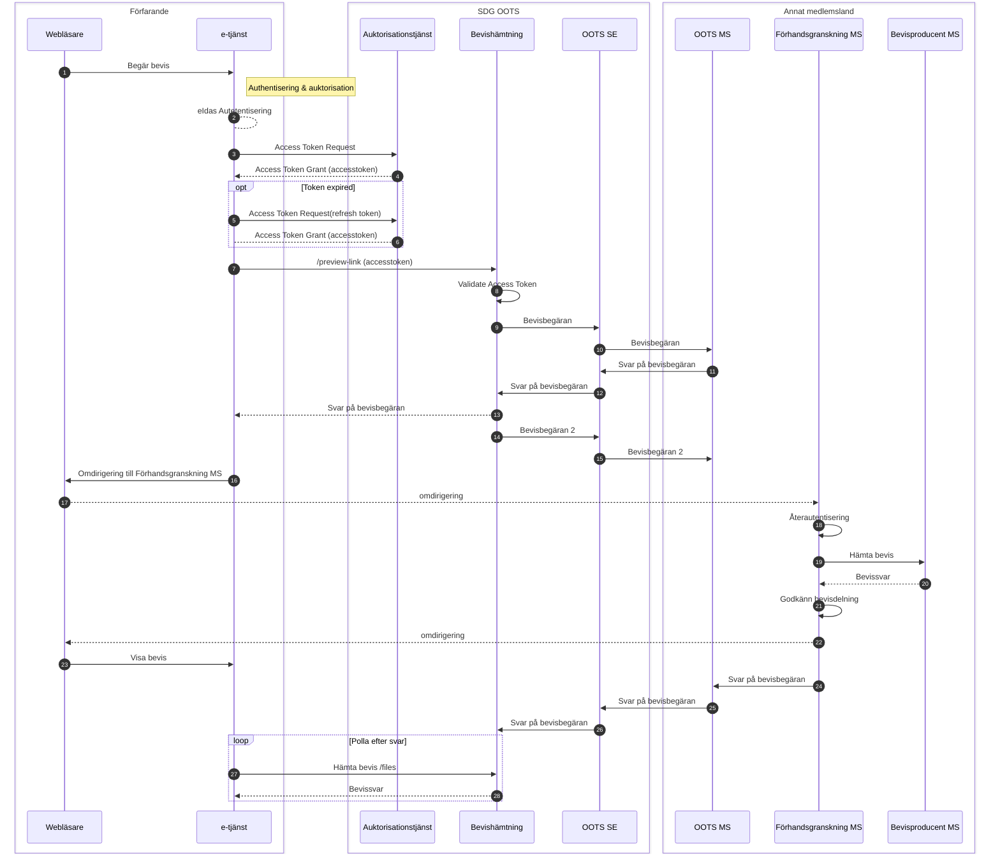

# SDG Bevishämtning, inom det tekniska systemet för bevisutbyte

## Översiktligt flöde
* Bevishämtning, svenskt onlinfeförarande hämtar bevis från annat medlemsland

### Auktorisationsflöde vid bevishämtning
#### Beskrivning

När en användare i ett svenskt onlineförfarande vill hämta ett digitalt bevis från ett annat medlemsland.
Ett svenskt onlineförfarand begär ett åtkomstintyg för att kunna anropa den svenska bevisförmedlingstjänsten för att hämta ett bevis via OOTS.

#### Flödesbeskrivning

* Använderaren vill hämta ett bevis från annat medlemsland
* E-tjänsten skickar en signerad begäran om åtkomst till SDG Auktorisationstjänst
* Auktorisationstjänsten validerar begäran och kontrollerar att e-tjänsten tillhör en behörig myndighet
* Auktorisationstjänsten ställer ut ett åtkomstintyg till e-tjänsten
* E-tjänsten anropar Bevisförmedlingstjänsten och bifogar åtkomstintyget
* Bevisförmedlingstjänsten validerar att åtkomstintyget är signerat av betrodd auktorisationstjänst
* Bevisförmedlingstjänsten gör en bevisbegäran via OOTS SE

#### Detaljerat flöde

*Diagram 1: Sekvensdiagram för bevishämtning*

