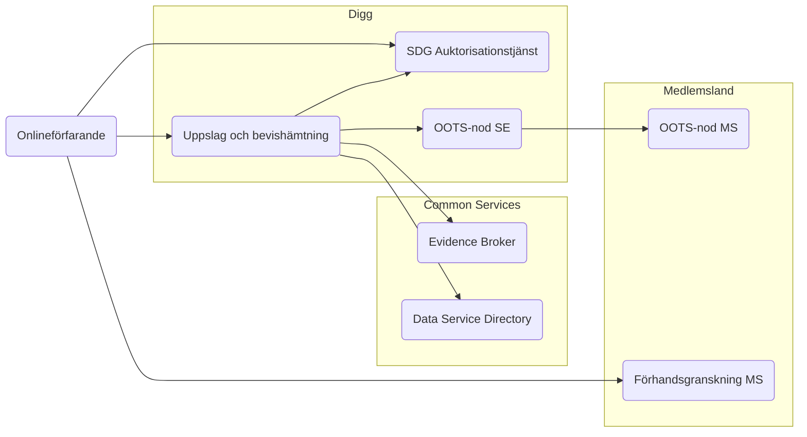
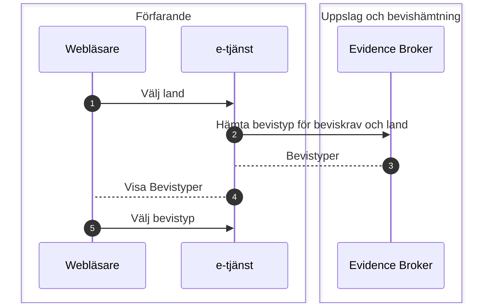
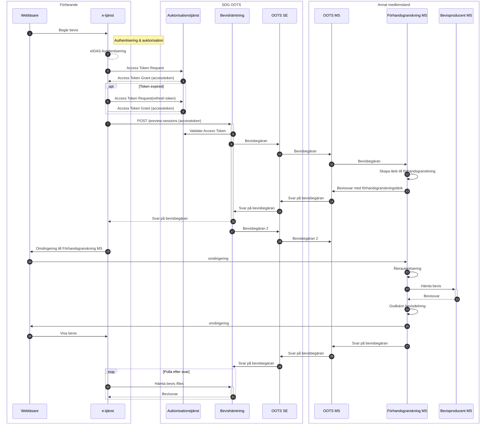

# SDG Uppslag och Bevishämtning, inom det tekniska systemet för bevisutbyte
Här finns beskrivningen av API:et för intermediationEU vilket är Diggs intermediära plattform för att erbjuda svenska behöriga myndigheter möjligheten att hämta bevis via det tekniska systemet för bevisutbyte (OOTS).

[Open-api-specen finns här](https://diggsweden.github.io/sdg-intermediation-se/)

## Översiktligt flöde
* Bevishämtning, svenskt onlinfeförarande hämtar bevis från annat medlemsland

*Diagram 1: Flödesdiagram för Uppslag och bevishämtning*

### Flödesbeskrivning översiktligt flöde

* Använderaren i ett onlineförfarande vill hämta ett bevis från annat medlemsland
* Användaren väljer bevistyp
* E-tjänsten skickar en signerad begäran om åtkomstintyg till SDG Auktorisationstjänst
* Auktorisationstjänsten validerar begäran och kontrollerar att e-tjänsten tillhör en behörig myndighet
* Auktorisationstjänsten ställer ut ett åtkomstintyg till e-tjänsten
* E-tjänsten anropar Bevishämtningstjänsten och bifogar åtkomstintyget
* Bevishämtningstjänsten validerar att åtkomstintyget är signerat av betrodd auktorisationstjänst
* Bevishämtningstjänsten gör en bevisbegäran via en svenska  accesspunkten OOTS-SE
* Andvändaren omdirigeras till bevislämnande lands förhandsgranskningstjänst
* Användaren väljer att dela beviset i förhandsgranskningstjänsten varpå beviset levereras över OOTS till bevishämtningstjänsten
* Onlineförfarandet hämtar beviset och låter användaren nyttja det i e-tjänsten

## Slå upp bevistyp via bevismetadatakatalogen
Ett onlineförfarande som har behov av att inhämta bevis behöver låta användaren ange det aktuella landet. Därefter kan förfarandet genom att ange sitt beviskrav (requirement) hämta vilka bevistyper som finns tillgängliga för detta beviskrav. Kunskapen om vilka beviskrav och bevistyper som ska väljas kan finnas hos onlineförfarandet eller avgöras av användaren. En bevistyp kan vidare tillhandahållas av en eller flera bevisproducenter varför ytterligare geografiska val behöver anges av användaren.  

Dessa filtreringsfunktioner finns tillgängliga via bevismetadatakatalogen (Evidence Broker) vilket är en del av  EUs gemensamma tjänster (Common Services). Informationen som erhålls av bevismetadatakatalogen används som inparametrar för att initiera en förhandsgranskning i det aktuella landet. Nedan beskrivs ett exempel på denna interaktion för att välja en nationell bevistyp.

### Flödesbeskrivning: Uppslag av bevistyp
1. Användaren i onlineförfarandet väljer från vilket land bevis ska hämtas.
2. E-tjänsten vet vilka beviskrav den har och anropar bevismetadatakatalogen för att lista bevistyper för beviskrav och land.
3. Lista av bevistyper returneras.
4. E-tjänsten presenterar listan av bevistyper
5. Användaren väljer bevistyp

## Detaljerat flöde: Bevishämtning

*Diagram 2: Sekvensdiagram för bevishämtning*

### Flödesbeskrivning detaljerat flöde
1. Användaren initierar en bevishämtning via e-tjänst.
2. Användaren authentiserar sig via eIDAS
3. E-tjänsten begär accesstoken från auktorisationstjänsten POST: /oauth2/token
4. Auktorisationstjänsten svarar med en Access Token Grant
5. Om giltighetstiden för accesstoken skulle ha löpt ut kan en ny hämtas mha refreshtoken
6. Access Token Grant levererar tillbaka ett nytt accesstoken
7. E-tjänsten inkluderar accesstoken till anropet POST: /evidence/preview-sessions med parametrar för att precisera efterfrågat bevis
8. Bevishämtningstjänsten validerar bifogat accesstoken POST: /oauth2/authorize
9. Bevishämtningstjänsten skapar en bevisbegäran som skickas via OOTS
10. Bevisbegäran transporteras via den svenska OOTS-noden till den OOTS-nod som finns i det bevisproducerande landet.
11. Förhandsgranskningstjänsten i bevisproducerande landet tar emot bevisbegäran från OOTS
12. Förhandsgranskningstjänsten skapar en unik och tidsbegränsad länk.
13. Bevissvar innehållandes länken till förhandsgranskning skickas tillbaka över OOTS.
14. Transport av bevissvar mellan OOTS-noder.
15. Bevissvaret levereras till Bevishämtningstjänsten
16. Bevissvaret innehållandes länk till förhandsgranskning samt conversationId returneras till e-tjänsten
17. Besvishämtningstjänsten skickar det bevisbegäran nr 2 vilken nu även innhåller förhandsgranskningslänken.
18. Bevisbegäran nr 2 skickas över OOTS.
19. E-tjänsten låter browsern veta adressen till förhandsgranskningstjänsten.
20. Browsern omdirigerar användaren till förhandsgranskningstjänsten i det bevisproducerande landet.
21. Förhandsgranskningstjänsten begär en återautentisering.
22. Förhandsgranskningstjänsten anropar bevisproducenten för att hämta bevis.
23. Bevisproducenten returnerar begärt bevis.
24. Användaren förhandsgranskar beviset och väljer att dela det.
25. Förhandsgranskningstjänsten omdirigerar användaren tillbaka till e-tjänsten.
26. Användaren begär att få använda beviset i e-tjänsten.
27. Förhandsgranskningstjänsten i det bevisproducerande landet skickar de bevis användaren har valt att dela över OOTS.
28. Bevissvar transporteras över OOTS-noder.
29. Bevissvaret levereras till bevishämtningstjänsten
30. E-tjänsten har fått en indikation om att bevis finns att hämta och använder conversationId för att anropa bevistjänsten en eller flera gånger via /evidence/preview-sessions/{conversationId}/files tills svar erhålls.
31. Bevissvar innehållandes bevis samt metadata returneras till e-tjänsten för vidare behandling. 

